# IfrTools
This repo holds a set of Azure infrastructure tools used to help deploy Infrastructure As Code(IaC) through a pipeline. These tools are meant to be deployed in support of your pipeline and also can be used during it. At this moment this repo consists of two tools.

- DNS checker
- Infrastructure Versioning Framework

## DNS Checker
The DNS checker is an Azure Function written in .NET Core/C# that queries local DNS to see if your CNAME/alias has propgated from your DNS provider to the rest of the world. The function accepts the following parameters.

- fqdn - Your fully qualified domain name. For instance www.abelurlist.com
- alias - Your CNAME alias. For instance urlistfdbeta.azurefd.net

You can pass these two parameters as URL querystring parameters or in the body of the request.
```json
{
    "fqdn" : "www.abelurlist.com",
    "alias" : "urlistfdbeta.azurefd.net"
}
```
This function will then check the local DNS to see if the CNAME has propgated and returns **_true_** if it has or **_false_** if it hasn't. This function can be used as an automated [pre or post deployment gate](https://docs.microsoft.com/en-us/azure/devops/pipelines/release/approvals/gates?view=azure-devops) in Azure Pipelines.

## Infrastructure Versioning Framework
This is a framework used to keep track of the version of your infrastructure deployed in Azure. It consists of an Azure Storage table used to hold the deployment stage (via the Partition Key), name of the IaC file that is deployed (via the Row Key),and the currently deployed version.

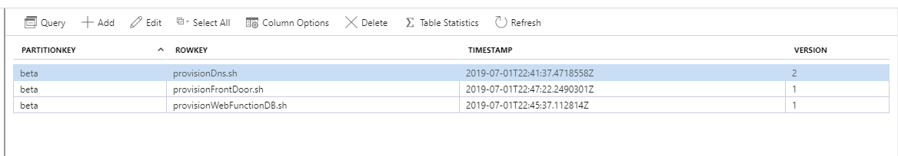

There are also two Azure functions. One used to query the table to see what version the infrastructure is currently at and another used to update the infrastructure version number.

### What is this versioning framework? Why do I care?
When it comes to Azure and IaC, there are basically 3 main options; ARM templates, Terraform, and Azure CLI scripts. ARM templates are awesome but they are PAINFUL to both create and debug. Terraform is powerful and cool but it doesn't always have providers for the latest new thing in Azure. Finally, there is the Azure CLI.

There are a lot of benefits to using the Azure CLI for your IaC for simple scenarios. For instance:

- It's intuitive to script out the infrastructure that you need
- It's easy to debug provisioning problems
- It's extremely readable

In fact, if you always completely tear down your infrastructure and redploy completely from scratch, Azure CLI scripts work spectacularily. But where it really craters is if you need to make incremental changes over time. Although some Azure CLI commands are idempotent (most creates are), not all commands are completely idempotent. Which means making changes over time is difficult and messy. You basically start wrapping all of your commands with if statements and pretty quickly, your scripts turn into a colossal mess that is a maintenance nightmare.

This versioning framework makes using the Azure CLI as your IaC simple. When writing your IaC scripts, you would wrap your commands in a bash function. For instance, here is my IaC file which deploys and configures my Azure Front Door instance:

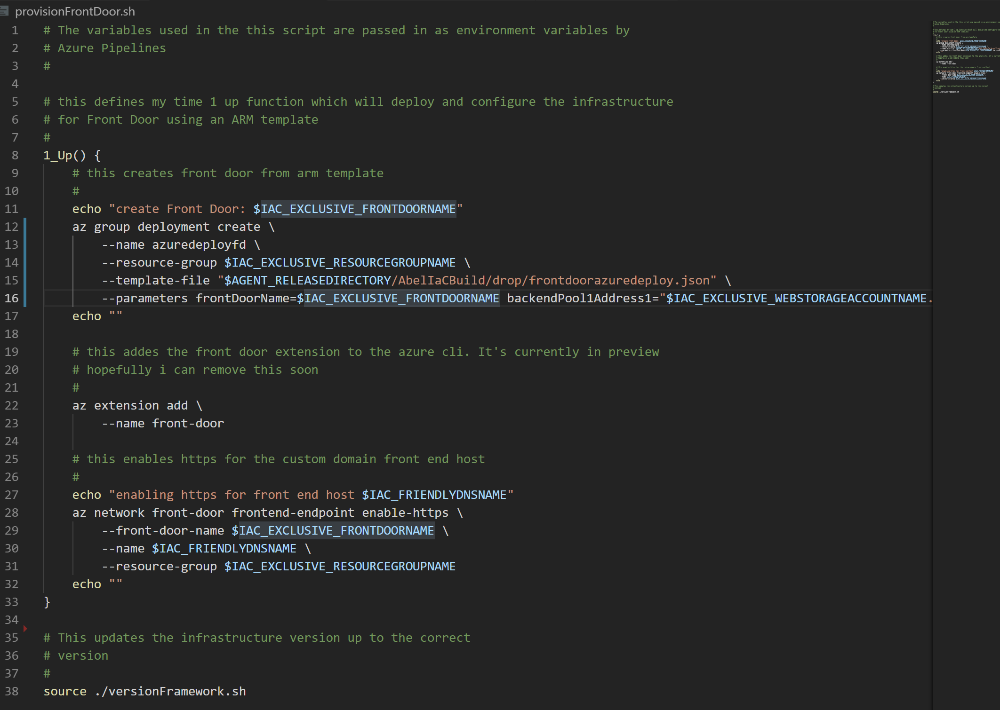

Notice at the end of the script file on line 38 there is:

`source ./versionFramework.sh`

That one line of code is what people need to add in their IaC script and it magically takes care of everything. And that file is included in this repo under [/InfrastructureVersionFrameworkScript/versionFramework.sh](/InfrastructureVersionFrameworkScript/versionFramework.sh)

In a nutshell, for every new version or change to your infrastructure, you add another #_Up function. When your IaC script is run in your pipeline, that extra line of code queries the azure table to see what is the current version deployed is, checks out the IaC script file to see what the latest _Up function is and the runs in order, the _Up functions needed to bring the current version deployed to match what is in the IaC file. It also updates the azure table with the new version number.

Again, the magic of it all is that as the author of an IaC script, you just wrap your code in sequential #_Up starting at 1 and everything else just happens magically for you.

For instance, if in the above IaC example I wanted to disable front-end https to my front door instance, all I would need to do is this:

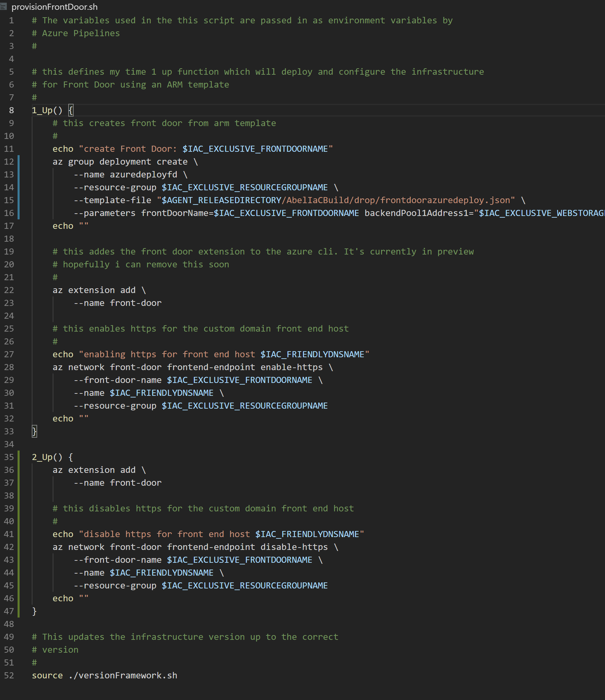

Just add a 2_Up function and add the code needed to disable front-end https. The infrastructure does all the rest for you. The next time a deployment is run, the framework will automatically go get the current version deployed (1). Will detect that there are 2 Up() functions in this script. And will figure out that it needs to run 2_Up() only. After running the Up functions needed in order (in this case only the 2_Up), it will also update the version table for you.

### Sounds great! any downsides to using this framework and the Azure CLI IaC?
Using this framework alongside the Azure CLI sparks joy in me. It actually works really well and does 3 things for me when using the Azure CLI as IaC.

1) Makes my IaC truely idempotent
2) Makes my IaC super easy to write (specially for changes. No more crazy conditionalis to determine if lines of code need to be run or not)
3) Makes maintaining my IaC code much simpler too. My IaC code no longer is a maintainance nightmare.

However, there is one thing it does not do that ARM templates do. And that's detect and correct drift. If someone goes into the azure portal and messes with things, Azure CLI method will not detect those changes and auto correct. Because of that, you should really lock down your resource group so only the service principal running these scripts has the ability to modify the resource groups being deployed. Maybe I'll add that next.

### Still Sounds super cool! How do I use this in my Azure Pipelines?
The first thing you need to do is build and package the tools. Included in this repo is an _azure-pipelines.yml_ file which will do just that in Azure Pipelines.

The second thing you need to deploy the infra tools into Azure. Again, included in this repo is an _azure-pipelines-full.yml_ file which will build and then release these tools into Azure. If you look in azure-pipelines-full and go to line 36, you will notice a bunch of variables that you will need to set.

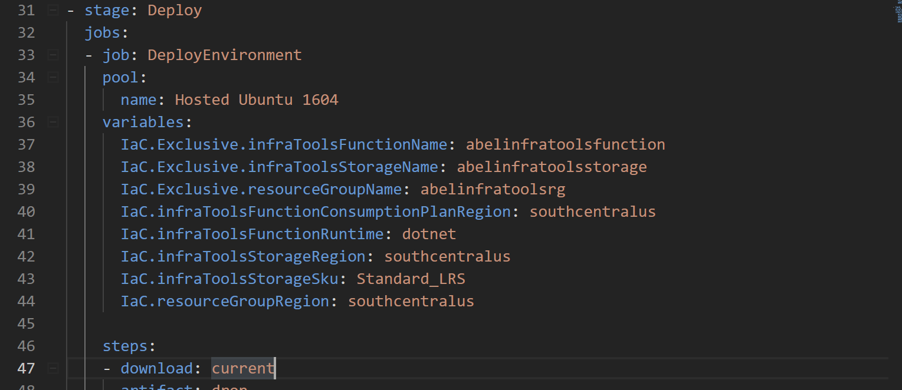

Also, if you go to line 54 and 61, you will need to swap in your own service principal to your azure subscription.

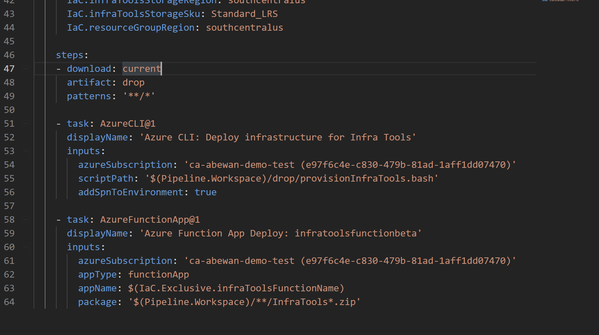

So what exactly does this full unified yaml pipeline do? It has two stages. A build stage and a deploy stage.

The build stage compiles the two azure functions, packages them up in a deployable zip file and then publishes the deployable zip and all the files in my /IaC folder as the build artifact for this builda. This IaC folder holds the infrastructure as code for the infra tools in both shell script and bat.

The deploy stage uses an Azure CLI task and runs the bash IaC file. This provisions all the assets needed for the infra tool up in azure. Next, it deploys the function to the provisioned function app and also configures everything so it's ready to go.

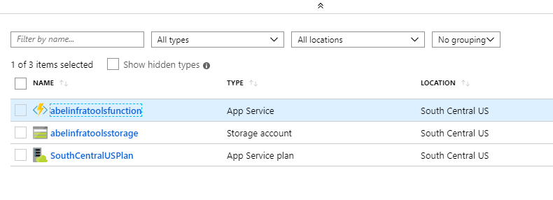

### Ok, now that I can build and deploy infra tools into Azure, how do I use versioning in my own pipeline?
Once the infra tools are deployed into Azure, you can now use it in your own pipeline.

First, make sure you copy the file /InfrastructureVersionFrameworkScript/versionFramework.sh to your own repo and put it next to your IaC bash files (at this moment, this only works on linux based agents and with bash scripts which hold your IaC. The next thing I need to do is implement all this with powershell so our windows and powershell friends aren't left out)

Second, write your IaC files using bash and wrap your code in a 1_Up() function.


At the end of your file, make sure you add source ./versionFramework.sh (Or whatever the path is to this file).  Any time you need to make a change to your infrastructure, go ahead and add another _Up() method in numerical order. So in my example, if I wanted to make some changes, I would add a 2_Up. And then later a 3_Up etc.

In order for all the magic to work correctly, you need to set three environmental variables (you can set environment variables by setting variables in Azure Pipelines).

- IaC.Exclusive.infraToolsFunctionName - This is the name of the function that was deployed when you deployed the infra tools. If you look in the _azure-pipelines-full.yml_ file and scroll down to the variable section, you'll see a variable named IaC.Exclusive.infraToolsFunctionName. Yup. That's it. Copy and paste that into your variables in your pipeline.
- IaC.infraTableName - This holds the name of the azure storage table to be used by the infra tools for your deployment. It makes sense to have one exclusive table name per pipeline. Remeber that with Azure Storage Table, you can have individual tables. And each table's data is organized by a partition key and a row key.
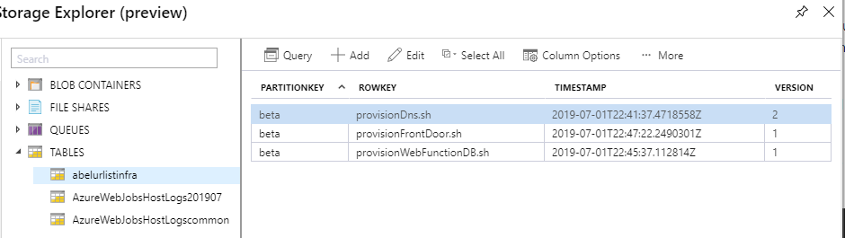
In the example above, the tablename is abelurlistinfra
- IaC.deploymentStage - This variable is used to hold the stage of your deployment. This variable will be used as the partition key. In the above example, my deployment stage is _beta_. When I get around to deploying a production environment, I'll also have a stage with the value of _prod_

## Real world example of using both versioning and dns checker
I created these infra tools because I needed them when I started writing the build and release pipeline for [The Urlist](https://github.com/the-urlist) project. The Urlist consists of a web front end writen in Vue.js, compiled down to static files and hosted in Azure Storage. It also has a back end function written in .NET Core and data is stored in Cosmos DB. And sitting in front of all of this is Azure Front Door.

Here is the release pipeline:

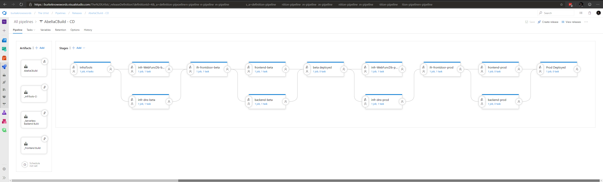

The release pipeline deploys out The Urlist to two environments. A beta environment and then a prod environment. I'll work my way from left to right and explain everything in this pipeline.

For our build artifacts, I'm pulling in the artifacts from

- AbelIaCBuild - This "build" just copies all of my IaC files for The Urlist project.
- _infTools-CI - This build compiles and packages up the infra tools. This build is literally the _azure-pipelines.yml_ build.
- _serverless Backend Build - This build compiles and packages up the backend code for The Urlist
- _Frontend Build - this build compiles down the front end website to static files

Next, my very first deployment stage is InfraTools.

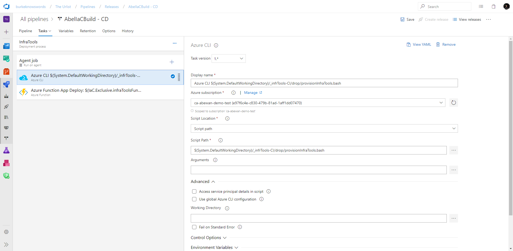

Here, I deploy the infrastructure for my infra tools (azure storage and an azure function) and also deploy the function code to the function. Wait!!!! Why am I deplying infra tools in the same pipeline and in the same resource group? You don't have to. You can actually have one instance of infra tools running somewhere and just pass in the correct variables (see above) and everything will work. However, I didn't want any dependencies on any other resource groups. I wanted to have my entire app completely self contained, including these tools. So the very first thing that I do is provision and deploy infra tools into my resource group.

Once that is done, I provision and configure the infrastructure for my azure storage to hold my static web site, the azure function and also my instance of Cosmos DB. I also provision in parallel my DNS settings to Cloudflare.

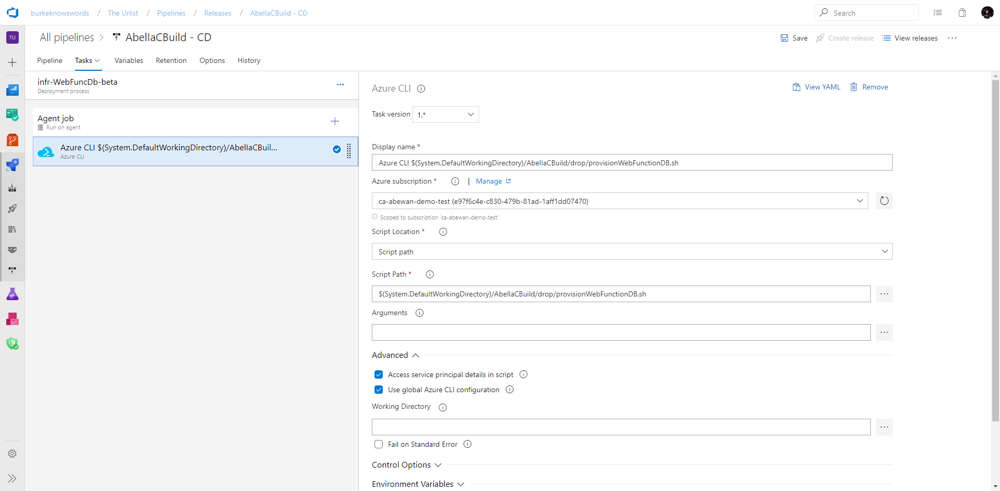

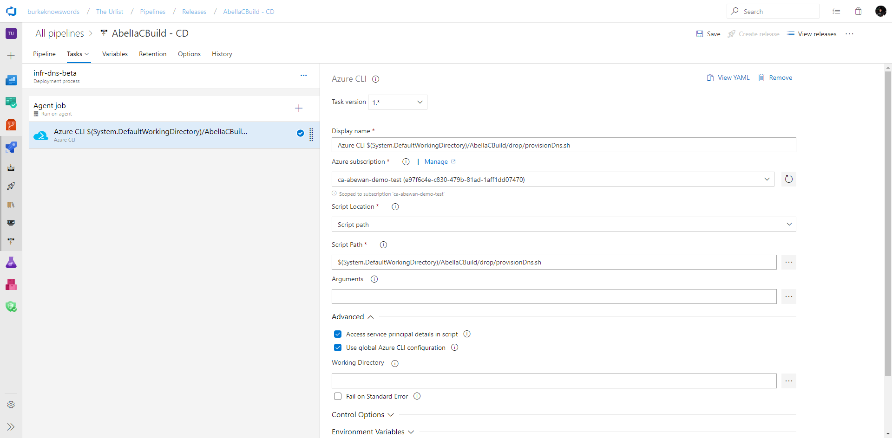

As you can see, there's nothing magical here. I just use an Azure CLI task to deploy my infrastructure using my IaC bash scripts.

Before I go on and deploy and configure my Front Door instance, I have to wait until DNS propogates. There are some settings in Front Door that can not be set until DNS has propogated. So to handle that, at the end of the infr-dns-beta stage, I configure a post deployment gate.

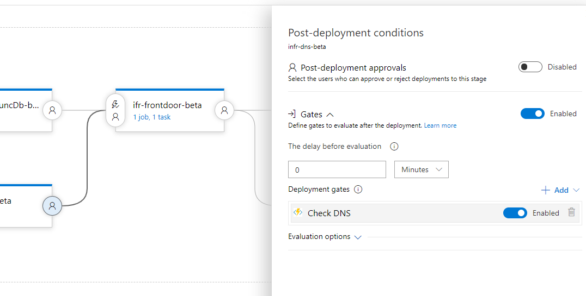

This gate polls the DNS checker in my infra tools to see if DNS has propagated. If it has, the gate passes. And if it hasn't, the gate fails and tries again in 5 minutes.

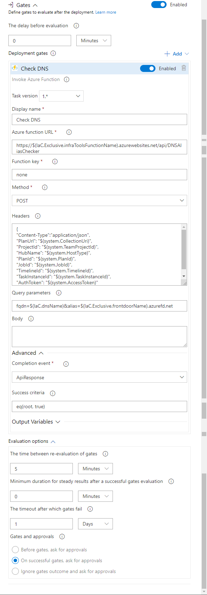

To configure this gate, I just use the out of the box azure function gate. I then point the url to `https://$(IaC.Exclusive.infraToolsFunctionName).azurewebsites.net/api/DNSAliasChecker`

`$(IaC.Exclusive.infraToolsFunctionName)` is the variable used to describe what the infra tools function name will be. This variable is used by both the IaC which provisions and deploys the infra tools and by this gate.

Next, I add the parameters needed by the DNS checker to the url parameter string. I could have added this in the POST body as well but for whatever reason, I just stuck it in the url parameter list. In the Query parameters text box, I enter in this:

`fqdn=$(IaC.dnsName)&alias=$(IaC.Exclusive.frontdoorName).azurefd.net`

And again, I use release variables to hold the DNS name and the alias CNAME. Finally, I configure the success criteria with

`eq(root, true)`

What this means is that if my function call returns back true, the gate passes. And if it returns back anything that's not true, the gate will fail.

So using this gate, this ensures that I don't go on to deploy and configure my front door instance until after DNS has propogated. Cool right?

Next I provision and configure my Azure Front door instance and then deploy my app to the the front end (Azure Storage) and the back end (Azure Function). I then have a manual approval gate and then rinse and repeat the process to deploy The Urlist to production.

If you want to see what my IaC looks like for The Urlist, it's all here in this repo:
https://github.com/the-urlist/IaC

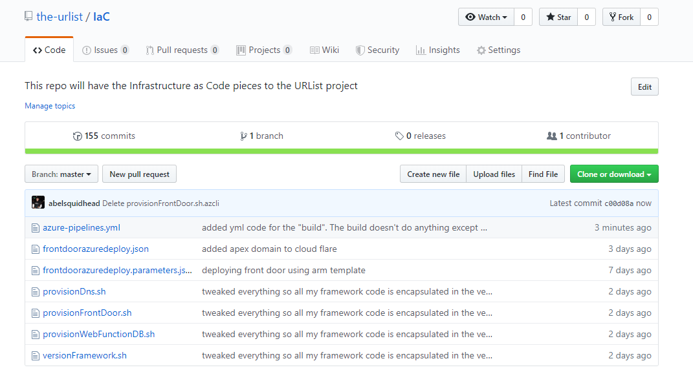

It has all my IaC files as bash scripts. Front Door has an ARM template. This is because there are some things that you just can't set Front Door with the Azure CLI. And conversly, there are some things you can't set with Front Door just using ARM templates. And finally, notice the versionFramework.sh file? Yup, that needs to be right next to my other IaC scripts.

## To Do
As it is right now, I think the versioning tool is pretty cool. Super clean IaC scripts using the Azure CLI. Easy to maintain. And super easy to author and use (wrap your commands in a method named 1_Up(), set some pipeline variables and add one extra line of code at the bottom of your script). And easy to debug as well. Much easier than those cryptic error messages from ARM templates :)

But there's still so much coolness that can be added. Here's the next few things that need to be worked on:

- impliment all of this using powershell instead of bash
- lock/unlock resource group so only the service principla running the scripts can change the resource group
- impliment rolling back/down functions.


## Links
- [YAML Pipelines in Azure Pipelines](https://docs.microsoft.com/en-us/azure/devops/pipelines/yaml-schema?view=azure-devops&tabs=example#download)
- [Table Storage](https://docs.microsoft.com/en-us/azure/storage/)
- [Deployment Gates](https://docs.microsoft.com/en-us/azure/devops/pipelines/release/deploy-using-approvals?view=azure-devops)
- [Azure Pipelines](https://docs.microsoft.com/en-us/azure/devops/pipelines/?view=azure-devops)
- [Release Variables in Azure Pipelines](https://docs.microsoft.com/en-us/azure/devops/pipelines/release/variables?view=azure-devops&tabs=batch)
